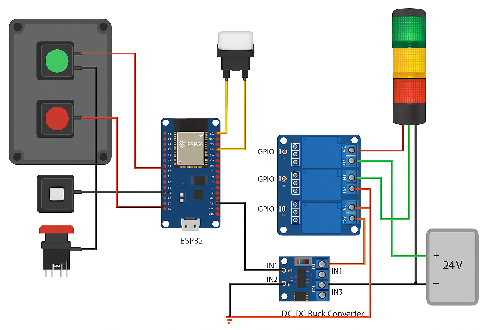

# 🤖 Robot Control Station - ESP32 Based

This repo contains the full setup for an ESP32-based robot control panel with:
- Start / Stop / Manual / E-Stop buttons
- Light Tree (Red / Yellow / Green)
- 24V power supply
- Node-RED integration

## 🧰 Components
- ESP32 Dev Board
- 24V Power Supply
- DC-DC Buck Converter (24V → 5V)
- 3-Channel Relay Module (3.3V logic)
- Momentary Buttons (Start, Stop, Manual)
- Latching E-Stop (NC)
- Signal Tower Light (24V Red/Yellow/Green)

## 🖥️ Control Logic
- Green: Start robot
- Red: Stop robot
- Yellow: Manual override mode
- Emergency: Safety stop with alert

## 🌐 Node-RED Integration
- ESP32 sends HTTP GET requests to:
  - `/robot/start`
  - `/robot/stop`
  - `/robot/manualOverride`
  - `/robot/emergencyStop`

## 📷 Wiring Diagram

## 🚀 Getting Started
1. Flash `esp32_main.ino` from the code folder
2. Wire components per diagram
3. Set up Node-RED endpoints
4. Power via 24V PSU through buck converter
5. Enjoy remote and physical control!

---

Licensed under MIT.
